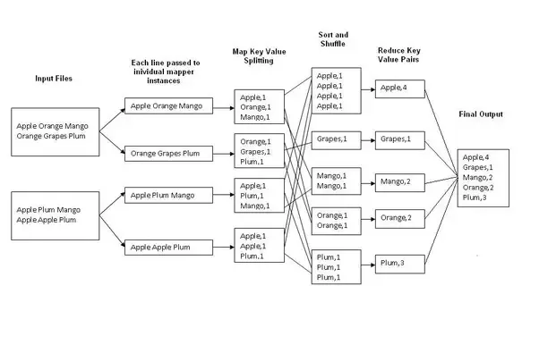

# StatsForLogs - A Distributed Log Processing System for Enormous Log Files


A distributed system built with **Hadoop File System(HDFS)** and deployed on **AWS** that employs a **map-reduce** approach to analyze substantial amounts of log data and extract meaningful statistics.

## Features
* Easily configurable time intervals
* Easy to install and run
* Capable of handling incorrect inputs with improper formats

## Map Reduce Fundamentals



Map Phase:

    Input data is divided into chunks.
    A "map" function is applied independently to each chunk, processing the input and generating intermediate key-value pairs.

Shuffle and Sort Phase:

    The intermediate key-value pairs are shuffled and sorted based on their keys to ensure that values with the same key end up on the same node.

Reduce Phase:

    A "reduce" function is applied to each group of key-value pairs with the same key.
    The reduce function processes these values and produces the final output.

Throughout these phases, HDFS (Hadoop Distributed File System) plays a pivotal role by serving as the storage platform for input and intermediate data. It facilitates parallel data processing by allowing nodes in the Hadoop cluster to access and process portions of the data concurrently. Additionally, HDFS ensures fault tolerance through the distribution of data blocks and their replicas across multiple nodes, enabling seamless processing even in the presence of node failures.

## Examples

### One


**In this example we will display how different types of messages are spread out over set time intervals. It will also show examples of added text that matches a specific pattern for these message types.**

Output Column Format
```
Time_Interval     No_of_Error    No_of_Warn   No_of_Info   No_of_Debug   Count_of_messages_with_regex 
```

Output Rows
```
04:27:00.0 - 04:27:59.9	 0   0   2   0   0
04:28:00.0 - 04:28:59.9	 1   4   7   1   0
04:29:00.0 - 04:29:59.9	 0   2   8   2   1
04:30:00.0 - 04:30:59.9	 1   5   3   0   0
04:31:00.0 - 04:31:59.9	 0   2   7   2   0
04:32:00.0 - 04:32:59.9	 0   3   9   0   1
04:33:00.0 - 04:33:59.9	 0   2   10  0   2
``` 

eg - for interval 04:29:00 to 04:29:59 we have  0 - Errors, 2 - Warns, 8 - Info, 2 - debug and 1 - regex containing message.

---
### Two

**The result exhibits the count of ERROR messages along with their corresponding string messages, following the designated regex pattern, arranged in descending order based on the count.**

Output Rows
```
10:00:00 - 10:59:59 	54
09:00:00 - 09:59:59 	28
07:00:00 - 07:59:59 	1
04:00:00 - 04:59:59 	0
05:00:00 - 05:59:59 	0
06:00:00 - 06:59:59 	0
08:00:00 - 08:59:59 	0
19:00:00 - 19:59:59 	0
Invalid Log Messages  	0
```
---
### Three

In this example output displays the total number of different error types(DEBUG, INFO, WARN, ERROR) present in the log files.

Output Rows
```
DEBUG	20468
ERROR	2103
INFO	148887
Invalid Log Messages : 	1
WARN	40543
```
---
### Four

Output  displays the highest number of characters in each log message type that that contains string of designated regex pattern.

Output Rows
```
DEBUG	105
ERROR	84
INFO	105
Invalid Log Messages : 	-1
WARN	105
```

## Prerequisites
This projects requires the followings:
- Java 11
- Apache Hadoop 3.3.4


## How to Run
To run this project:

1. Generate the Jar file by running the following command in program root directory
```
sbt clean compile assembly
```
The Jar can be found in ***target/scala-3.1.3/***

2. Start the local hadoop instance
```
start-all.sh
```

3. Create input directory in hadoop distributed filesystem
```
hadoop fs -mkdir -p <INPUT_DIRECTORY_PATH>
```
5. Copy the log files from your local filesystem to hadoop filesystem
```
hadoop fs -put <PATH_TO_LOGFILES_ON_YOUR_LOCAL_FILESYSTEM> <INPUT_DIRECTORY_PATH>
```
6. Executing Map-Reduce job (For running the command below, ensure to copy the Jar file in the current directory)
```
hadoop jar <GeneratedJarName> com.yash.RunProject <INPUT_DIRECTORY_PATH> <Output_Path>
```
**Note : make sure Output_path is an empty directory**

